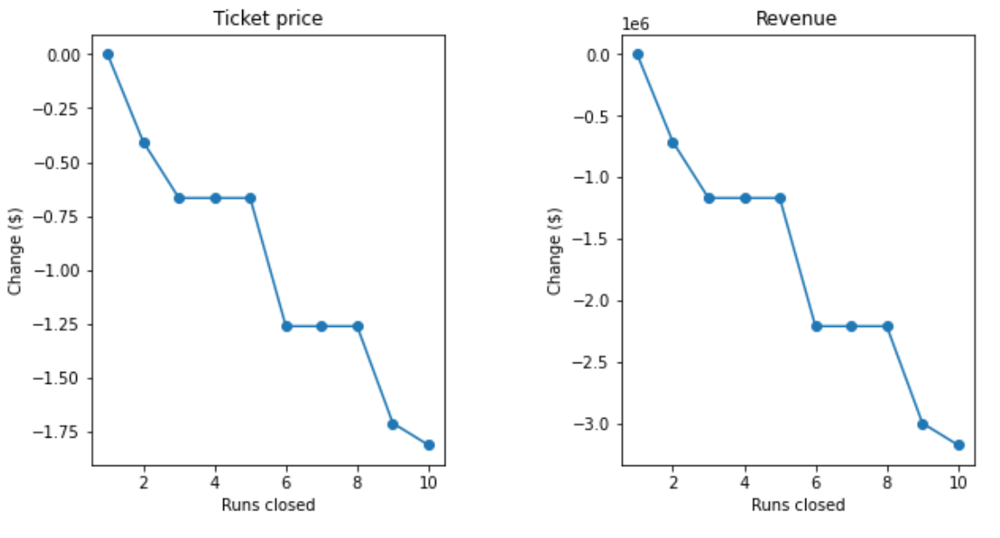

## Project Report

In this project, a pricing model was created for ski resorts tickets in the market segment. Big Mountain Resort suspects that it may not be maximizing its returns, relative to its position in the market. It also does not have a strong sense of what facilities matter most to visitors, particularly which ones they’re most likely to pay more for. So, this model will be used to provide guidance for Big Mountain’s pricing and future facility investment plans. 

Our target feature was ‘AdultWeekend’ and there were quite a few reasonable correlations observed. Some of them were fast quads, runs, total chairs, snow making area, vertical drop. The model that was used to predict the ticket prices was Random Forest model. In our model the top 4 most important features are fast quads, runs, snow making capability, vertical drop, as can be seen in the figure below. Our model predicted that the ticket price for Big Mountain Resort should be $95.87, as opposed to the actual price $81.00.

Big Mountain Resort has been reviewing potential scenarios for either cutting costs or increasing revenue (from ticket prices). The resort is free to set whatever price it likes. However, the resort operates within a market where people pay more for certain facilities and less for others. This is where the model we created comes in, to give a sense of how facilities support a given ticket price. Big Mountain has shortlisted some options. Primarily 4 model scenarios. In these, the expected number of visitors over the season is 350,000 and, on average, visitors ski for five days.

In the first scenario, which is closing up to 10 of the least used runs, the model says that closing one run makes no difference. Closing 2 and 3 runs successively reduces support for ticket price and so the revenue. If Big Mountain closes 3 runs, it seems they may as well close down 4 or 5 as there is no further loss in ticket price. Closing down 6 or more runs leads to a large drop in ticket price and so revenue, as can be seen in the figure below.

The second scenario suggests that Big Mountain add a run, increase the vertical drop by 150 feet, and install an additional chair lift. This increases support for the ticket price by $1.99. Over the season, this could be expected to amount to $3,474,638. The Third scenario, which is the same as the second but adding 2 acres of snow, makes no difference in the ticket price.

The fourth scenario calls for increasing the longest run by .2 miles and guaranteeing its snow coverage by adding 4 acres of snow making capability. This also does not make any difference whatsoever in the ticket prices. 

So, the second modeled scenario seems the best for further consideration.
